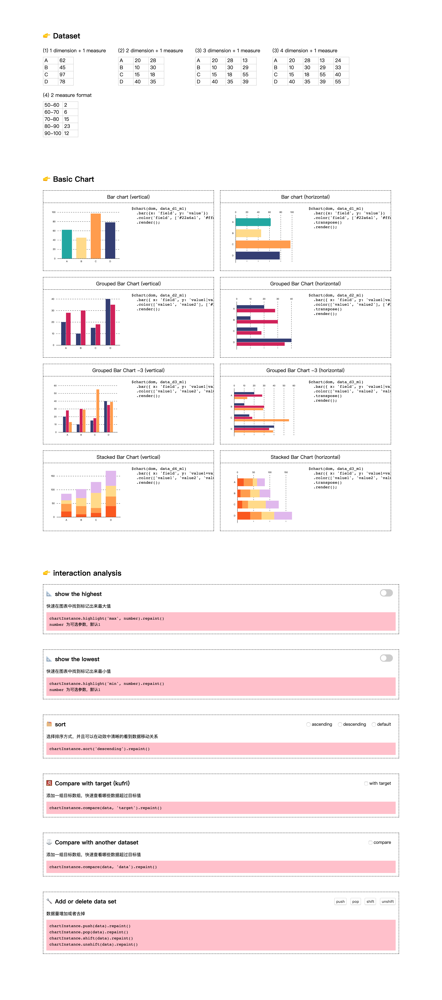

# d3-chart-package

## What is it
Use it ,you can program reguler chart quickly based on [d3.js](https://github.com/d3/d3). 
* Chart type: Including but not limited to bar, line, scatter and pie.
* Configuration: At the beginning, it will not open the configuration items very detaily. The thinking of default configuration comes from [Gradict](http://tuzhidian.com/)

## The difference (sparkle)
**For business analysis scenarios**

example:
* You can easily use `.sort()` to sort bar chart, then get ranking information.
* You can easily use `.hightlight('max', 3)` to get the top three.
* You can easily use `.compare(data)` to compare data with last year.
* ...

All of the above can be done with animation, you can clearly see the relationship between the data.

The overview idea is as follows.

## How to use

1. `npm install d3-chart-package`
2. `import $chart from 'd3-chart-package'`
3. `$chart(dom, data).bar({x: 'field', y: 'value'}).render()`
  Add use below script to see more api.

## Script

* Development mode `npm run start` then you can see web page as follows

* Publish npm package
  `npm run build` `npm publish`

## dev log
- [X] bar
- [X] grouped bar chart
- [X] stacked bar chart
- [ ] Histogram
- [ ] interaction
- [ ] ...
