

# Graph List 图表实现列表

从常用图表来看，可以分成几个大类（分类标准并不代表可视化理念，有的按坐标系分开，有的按数据关系分开，取决于涉及到的常用图表数量）。

目前做的顺序也是按从上到下的分类来做，具体实现会参考可视化理念。

## 1. 直角坐标系

### point

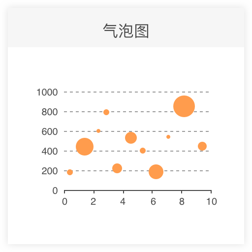
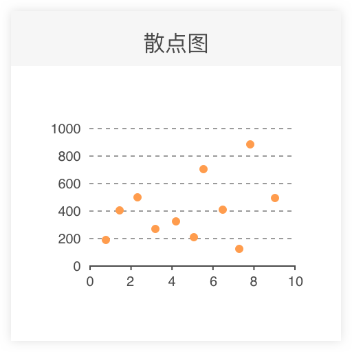

### interval

以下的每一个都可以通过 coord.transpose 转置成条形图

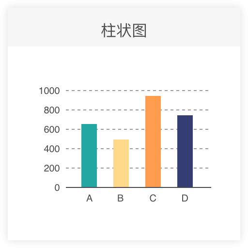
[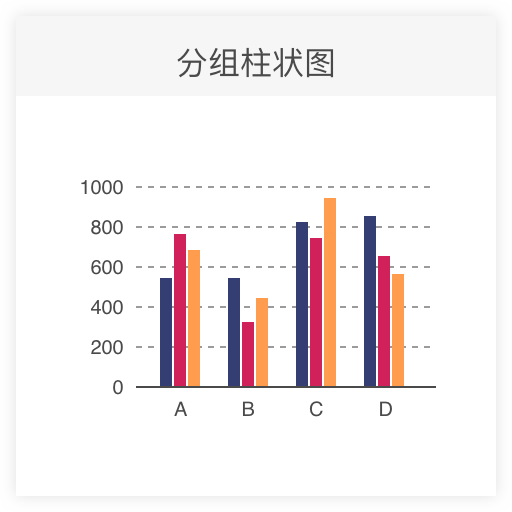](https://observablehq.com/@d3/grouped-bar-chart)
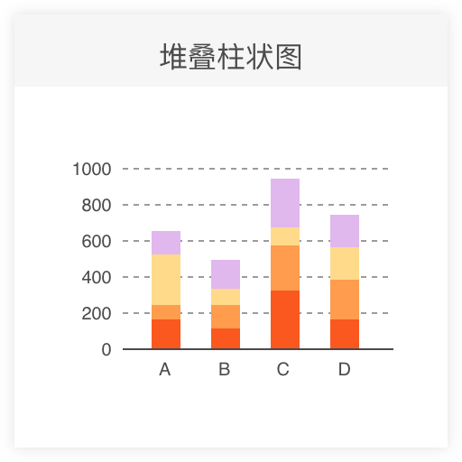
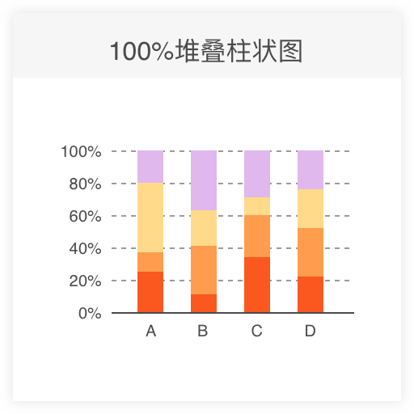
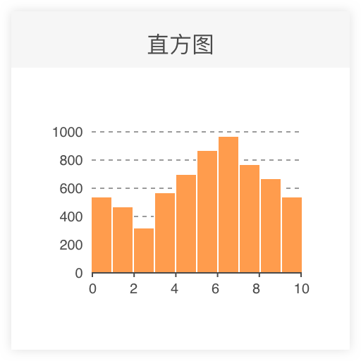

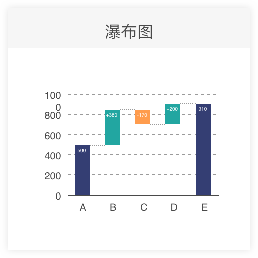
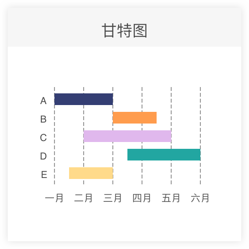
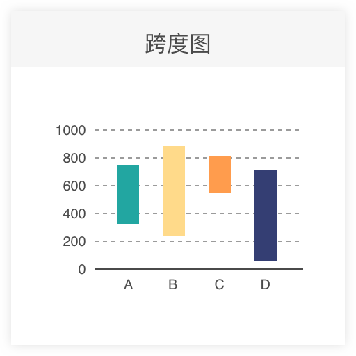

### area

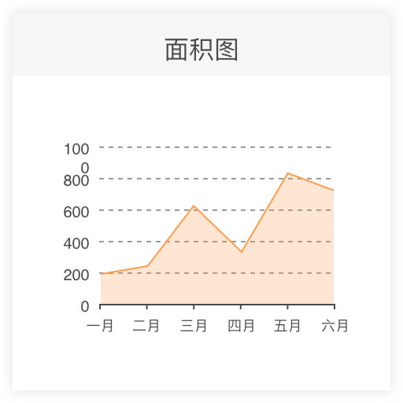
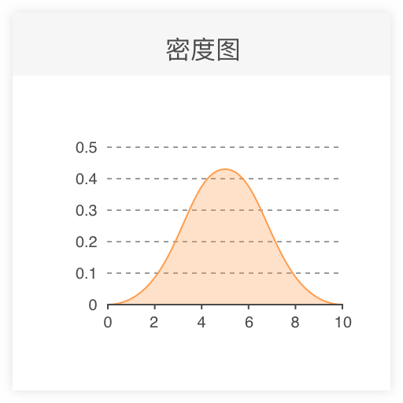
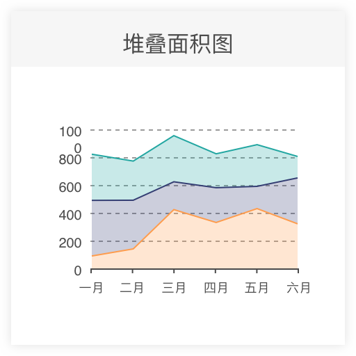
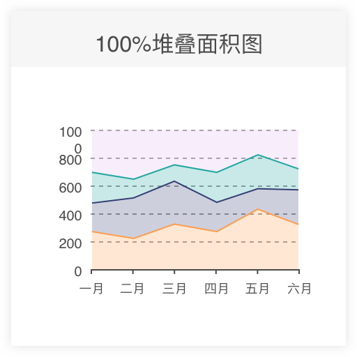
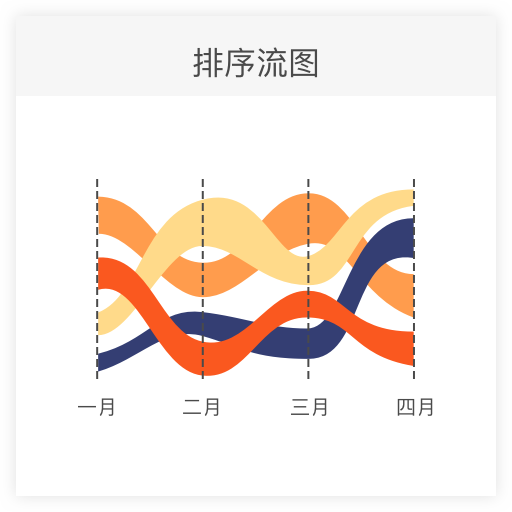
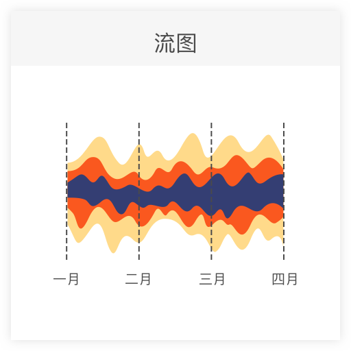

### line

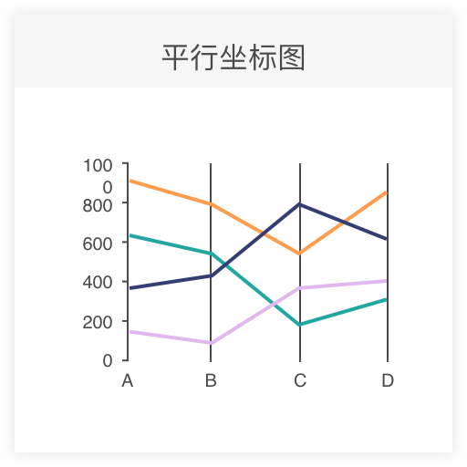

### others

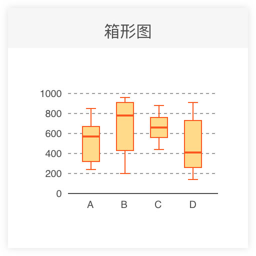
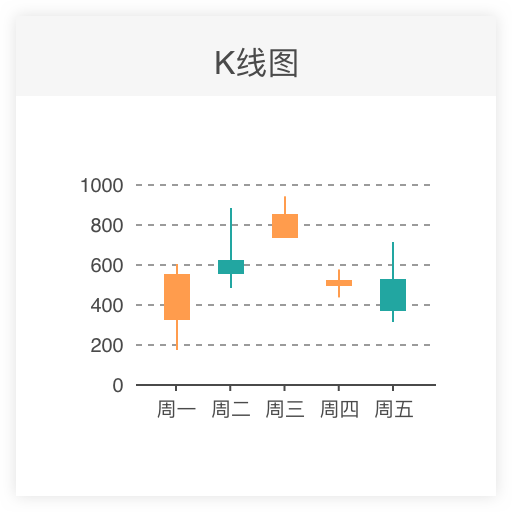
[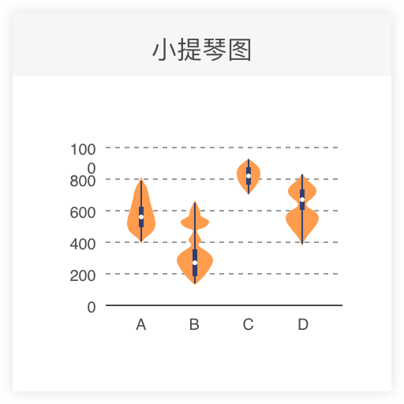](https://www.d3-graph-gallery.com/graph/violin_basicHist.html)
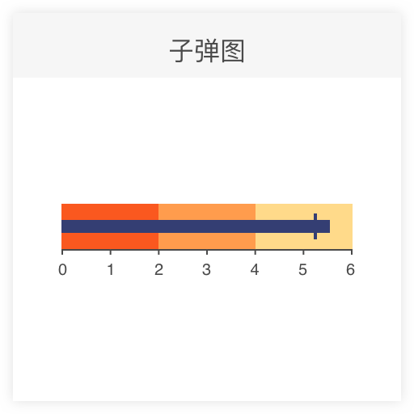
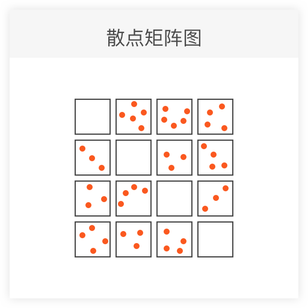
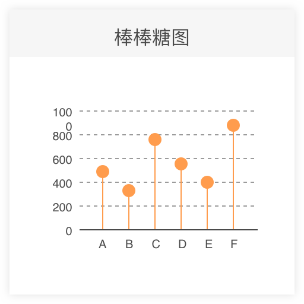

## 2. 极坐标系

## 3. 层次结构数据

## 4. 地理坐标系
