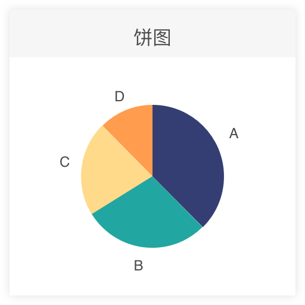
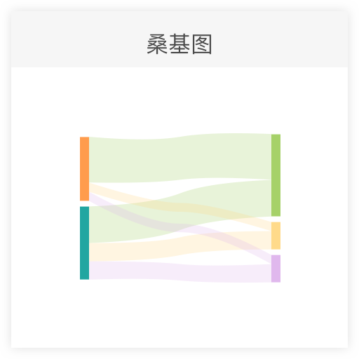
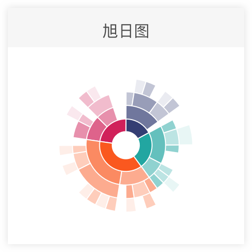
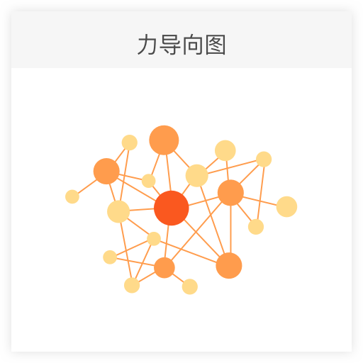
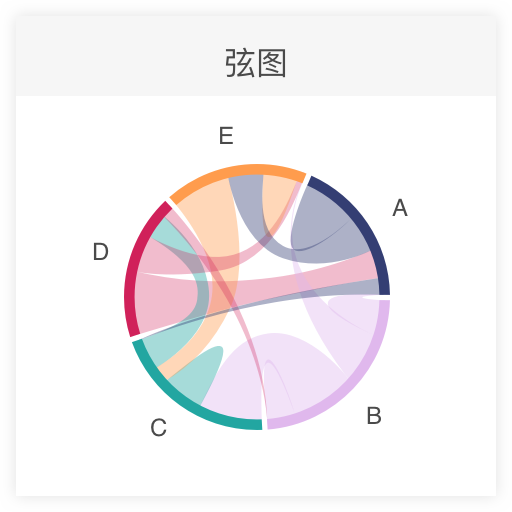
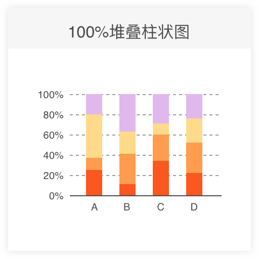
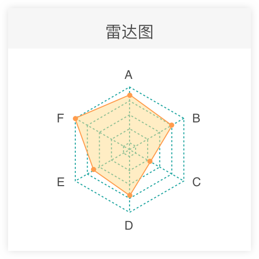
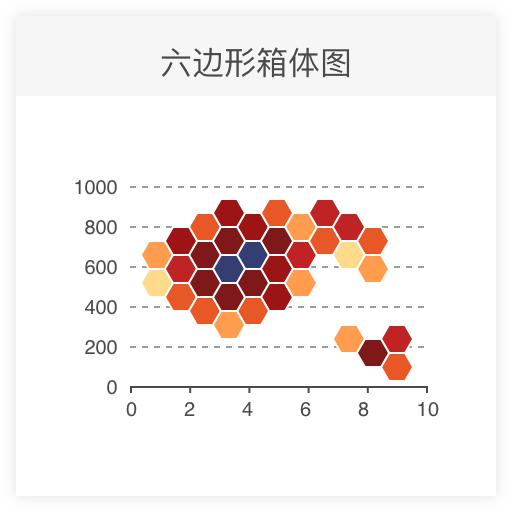
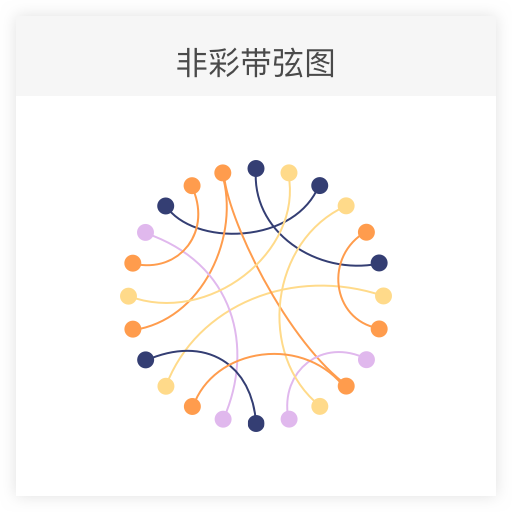

# Graph needs todo

## 图之典已收录的图表

- [ ] 饼图 Pie

- [ ] 桑基图 Sankey Diagram

- [X] 平行坐标系 Parallel Coordinates

- [ ] 旭日图 Sunburst

- [ ] 树图 Treemap

- [X] 气泡图 Bubble chart

- [ ] 力导向图 Force Directed Graph

- [ ] 弦图 Chord Diagram

- [ ] 漏斗图 Funnel Chart

- [X] 柱状图 Bar Chart

- [X] 堆叠柱状图 Stacked Bar Chart

- [X] 100%堆叠柱状图 100% Stacked Bar Chart

- [X] 热力图 Heatmap

- [ ] 南丁格尔玫瑰图 Nightingale Rose Chart

- [X] 散点图 Scatter plot

- [ ] 雷达图 Radar Chart

- [X] 面积图 Area Chart

- [X] 堆叠面积图 Stacked Area Graph

- [X] 箱形图 Box plot

- [ ] 六边形分箱图 Hexagonal Binning

- [ ] 折线图 Line Chart

- [X] 直方图 Histogram

## 图之典未收录的图表

- [ ] 环图 Donut Chart

- [ ] 打包气泡图 Packed Bubble Chart

- [ ] 非彩带弦图 Non-ribbon Chord Diagram

- [ ] 排序流图 Sorted Stream Graph

- [ ] 流图 Stream Graph

- [ ] 点阵图 Dot Matrix Chart

